ThreadLocal是Java中一个非常有用的类，它可以让我们在多线程环境下安全地创建和使用线程本地变量。ThreadLocal的实现原理是使用ThreadLocalMap来存储线程本地变量。ThreadLocalMap是一个自定义的哈希表，它的键是ThreadLocal对象，值是线程本地变量。

每个线程都有一个ThreadLocalMap，它存储了该线程所持有的所有ThreadLocal变量。当我们调用ThreadLocal的get()方法时，它会先获取当前线程的ThreadLocalMap，然后以ThreadLocal对象作为键来获取对应的线程本地变量。如果没有对应的变量，则会调用initialValue()方法创建一个新的变量，并将其存储到ThreadLocalMap中。当我们调用ThreadLocal的set()方法时，它会先获取当前线程的ThreadLocalMap，然后以ThreadLocal对象作为键来设置对应的线程本地变量。

以下是ThreadLocalMap的简单实现：

```
class ThreadLocalMap {
    static class Entry extends WeakReference<ThreadLocal<?>> {
        Object value;
        Entry(ThreadLocal<?> k, Object v) {
            super(k);
            value = v;
        }
    }

    private Entry[] table;

    private void set(ThreadLocal<?> key, Object value) {
        // 获取当前线程的ThreadLocalMap
        Thread currentThread = Thread.currentThread();
        Entry[] table = getTable(currentThread);

        // 计算key的哈希值
        int hash = key.hashCode() % table.length;

        // 遍历table，查找key对应的Entry
        for (Entry e = table[hash]; e != null; e = e.next()) {
            ThreadLocal<?> k = e.get();
            if (k == key) {
                e.value = value;
                return;
            }
        }

        // 如果没有找到对应的Entry，则创建一个新的Entry并放入table中
        Entry e = new Entry(key, value);
        e.next = table[hash];
        table[hash] = e;
    }

    private Object get(ThreadLocal<?> key) {
        // 获取当前线程的ThreadLocalMap
        Thread currentThread = Thread.currentThread();
        Entry[] table = getTable(currentThread);

        // 计算key的哈希值
        int hash = key.hashCode() % table.length;

        // 遍历table，查找key对应的Entry
        for (Entry e = table[hash]; e != null; e = e.next()) {
            ThreadLocal<?> k = e.get();
            if (k == key) {
                return e.value;
            }
        }

        // 如果没有找到对应的Entry，则调用initialValue()方法创建一个新的变量
        Object value = key.initialValue();
        Entry e = new Entry(key, value);
        e.next = table[hash];
        table[hash] = e;
        return value;
    }

    private Entry[] getTable(Thread t) {
        return table;
    }
}
```

# 分布式锁的三种实现方式

- 基于数据库（唯一索引）
- 基于缓存（Redis，memcached，tair）
- 基于Zookeeper

# mysql索引失效的情况

1. 最左前缀匹配原则：mysql会一直向右匹配直到遇到范围查询(>、<、between、like)就停止匹配，比如a = 1 and b = 2 and c > 3 and d = 4 如果建立(a,b,c,d)顺序的索引，d是用不到索引的，如果建立(a,b,d,c)的索引则都可以用到，a,b,d的顺序可以任意调整。
2. like   %写在前边
3. <> 或 =使索引失效   改用  exits   not in 
4. 索引字段查询条件使用函数计算
5. is null   is not null 可能不走索引   当null值较少   使用is not null  不走索引；
6. or 左右两边需要都是索引字段  否则不走索引 
7. 字符串没加引号  类型转换

# 常见sql优化

1. 小表驱动  in 小表在右  exists小表在左，用join替代子查询  子查询会创建临时表然后再删除，join建议不超过3个，不然会增加索引的复杂度；
2. 高效分页  limit 前加查询条件缩小查询范围
3. 索引优化  索引控制在5个  索引字段也控制在5个  可以用复合索引替换单个字段的索引
4. 能用数字类型，就不用字符串，因为字符的处理往往比数字要慢。金额用decimal，防止精度丢失
5. 定长用char，边长varchar


ArrayList不是线程安全的，因此在多线程环境下对其进行操作可能会导致以下错误：

1. ConcurrentModificationException：如果一个线程在迭代ArrayList时，另一个线程修改了它，就会抛出此异常。
2. IndexOutOfBoundsException：如果一个线程在添加或删除元素时，另一个线程也在操作ArrayList，就可能导致索引越界。
3. NullPointerException：如果一个线程在读取ArrayList中的元素时，另一个线程删除了该元素，就会导致NullPointerException。

以下是一个可能导致上述错误的示例代码：

```
import java.util.ArrayList;

public class ArrayListThreadDemo {

    public static void main(String[] args) {
        ArrayList<Integer> list = new ArrayList<>();
        list.add(1);
        list.add(2);
        list.add(3);

        Runnable runnable = () -> {
            try {
                Thread.sleep(1000);
            } catch (InterruptedException e) {
                e.printStackTrace();
            }
            list.add(4);
        };

        Thread thread = new Thread(runnable);
        thread.start();

        for (Integer integer : list) {
            System.out.println(integer);
            if (integer == 2) {
                list.remove(integer);
            }
        }
    }
}
```


# Lock与synchronized的区别

1. Lock是一个接口，而synchronized是Java中的关键字。
2. Lock可以具有更高的性能和更多的灵活性，例如可重入锁，公平锁和读写锁等，而synchronized只能是非公平锁。
3. Lock可以在代码块中任意地获取和释放锁，而synchronized只能在方法或代码块级别获取和释放锁。
4. Lock需要显式地获取和释放锁，而synchronized会自动获取和释放锁。
5. Lock可以通过tryLock()方法尝试获取锁，而synchronized无法尝试获取锁。
6. Lock可以使用Condition接口和await()、signal()和signalAll()方法实现更精细的线程间通信，而synchronized无法实现这种通信。

以下是使用Lock和synchronized实现同步的示例代码：

使用Lock：

```
Lock lock = new ReentrantLock();

public void method() {
    lock.lock();
    try {
        // 临界区代码
    } finally {
        lock.unlock();
    }
}
```

使用synchronized：

```
public synchronized void method() {
    // 临界区代码
}
```

# new 对象的过程

1. 分配内存：在堆内存中分配一块内存空间，用于存储对象的数据。
2. 初始化对象：对对象的数据进行初始化，包括成员变量的初始化等。
3. 返回对象的引用：返回对象的引用，以便程序可以使用该对象。

# AQS原理

AQS是Java中AbstractQueuedSynchronizer的简称，它是Java中用于实现同步器的基础框架。AQS的核心思想是使用一个volatile的状态变量和一个FIFO队列来保证线程之间的互斥和协同工作，它的实现基于对Java中Lock和ReentrantLock的抽象和封装。

在具体实现上，AQS使用一个整数state表示同步状态，通过CAS(Compare-And-Swap)操作保证多线程间的同步。当线程需要获取同步状态时，它会首先尝试使用CAS操作将state转换为指定的同步状态。如果CAS操作从新的state返回true，那么表示线程成功地获取了同步状态；否则，线程将被挂起，加入到同步队列中，并在当前线程释放同步状态时被唤醒。

AQS使用一个内置的FIFO队列来存储等待获取同步状态的线程，并按照先进先出的顺序唤醒被挂起的线程。它也提供了一些方法，允许子类以及使用者根据需要来自定义等待队列和阻塞策略。

总之，AQS是Java中用于实现同步器的基础框架，它的核心思想是使用一个volatile的状态变量和一个FIFO队列来保证线程之间的互斥和协同工作。我们可以利用它实现各种同步工具，如CountDownLatch、Semaphore、ReentrantLock等。


# 数组与队列的区别

1. 数组的长度是固定的，而队列的长度是可变的。
2. 数组的元素可以通过索引值来访问，而队列的元素只能从队列的头部或尾部访问。
3. 数组的元素在内存中是连续存储的，而队列的元素可以在内存中任意位置存储。
4. 数组可以用于存储静态数据，而队列通常用于存储动态数据。


# 内存溢出和内存泄漏的区别

内存溢出和内存泄漏都是与程序运行时使用的内存相关的问题，但它们的表现和原因不同。

内存溢出（Memory Overflow）指的是程序在申请内存时，没有足够的可用内存供其使用，导致程序崩溃或异常结束。它通常是由于程序本身的缺陷或错误导致的，比如程序中使用了无限循环或者递归调用等，导致内存不断被占用而无法释放，最终导致内存溢出。

内存泄漏（Memory Leak）指的是程序在使用内存时，没有及时地释放已经不再需要的内存，导致内存浪费和程序性能下降。它通常是由于程序中的代码没有正确地释放内存所导致的，比如程序中使用了动态分配内存的函数（如malloc等），但没有使用相应的释放内存的函数（如free等），导致内存泄漏。

以下是代码示例：

内存溢出的代码示例：

```
int main() {
    int* ptr;
    while(true) {
        ptr = new int[1000000];
    }
    return 0;
}
```

该程序使用while循环不断申请内存空间，但没有释放已经申请的内存，最终导致内存溢出。

内存泄漏的代码示例：

```
int main() {
    int* ptr = new int[1000000];
    ptr = new int[2000000];
    return 0;
}
```

该程序在第一行申请了1000000个int类型的内存空间，但在第二行又申请了2000000个int类型的内存空间，导致之前申请的内存空间没有被释放，最终导致内存泄漏。

jmap -heap PID //当前命令可以查看进程中内存的占用情况,进程的内存配置情况


1. 内存溢出

内存溢出是指程序在申请内存时，没有足够的内存空间来分配需要的内存。在Java中，内存溢出通常是由于以下原因导致的：

- 内存泄漏：未释放不再使用的对象，导致内存被占用。
- 无限递归：递归调用次数过多，导致栈内存溢出。
- 大对象：申请的对象过大，无法在堆内存中分配。

排查内存溢出的方法：

- 使用内存分析工具（如Eclipse Memory Analyzer）分析堆内存使用情况，找到占用内存较多的对象，并分析其引用链，找到可能的内存泄漏点。
- 检查代码中是否存在无限递归的情况。
- 检查代码中是否存在申请大对象的情况。

1. 内存泄漏

内存泄漏是指程序中存在一些对象，它们不再被使用，但是由于没有被正确释放，导致内存被占用。内存泄漏通常是由于以下原因导致的：

- 对象未被正确释放：程序中申请了一些资源（如文件、网络连接等），但是没有正确释放，导致内存泄漏。
- 对象被错误的缓存：程序中将一些对象缓存起来，但是没有正确管理缓存，导致内存泄漏。
- 对象被错误的持有：程序中将一些对象持有，但是没有正确释放，导致内存泄漏。

排查内存泄漏的方法：

- 使用内存分析工具（如Eclipse Memory Analyzer）分析堆内存使用情况，找到占用内存较多的对象，并分析其引用链，找到可能的内存泄漏点。
- 检查代码中是否存在未正确释放资源的情况。
- 检查代码中是否存在对象被错误的缓存或持有的情况。


# kafka幂等性

Kafka幂等性是指在生产者向Kafka发送消息时，可以确保同一个消息不会被重复写入到Kafka中。这可以通过在生产者端使用幂等性生产者来实现。幂等性生产者会对每个消息生成一个唯一的ID，并在发送消息时检查这个ID是否已经被使用，如果已经被使用，则不会发送该消息。

以下是使用Java代码创建幂等性生产者的示例：

```
Properties props = new Properties();
props.put("bootstrap.servers", "localhost:9092");
props.put("acks", "all");
props.put("retries", 0);
props.put("batch.size", 16384);
props.put("linger.ms", 1);
props.put("buffer.memory", 33554432);
props.put("enable.idempotence", true); // 开启幂等性

Producer<String, String> producer = new KafkaProducer<>(props, new StringSerializer(), new StringSerializer());
```

# 内部类

Java内部类是指在一个类的内部定义的类，它可以访问外部类（也称为包含类）的所有成员，包括私有成员。Java内部类的使用有以下几个方面。

1. 成员内部类：成员内部类是定义在外部类内部但不在任何方法中的类。它可以访问外部类的成员变量和方法，可以使用任何访问修饰符来修饰它。

下面是一个例子：

```
public class Outer {
    private int x = 10;

    public class Inner {
        public void printX() {
            System.out.println(x);
        }
    }
}
```

在上面的例子中，成员内部类 Inner 可以通过外部类 Outer 的对象访问 x，如下所示：

```
Outer outer = new Outer();
Outer.Inner inner = outer.new Inner();
inner.printX(); // 输出 10
```

1. 静态内部类：静态内部类是指在外部类内部但被声明为静态的类。他不能访问外部类的实例变量和方法，但可以访问静态变量和方法，并且可以被其他类直接使用。

下面是一个例子：

```
public class Outer {
    private static int x = 10;

    public static class Inner {
        public void printX() {
            System.out.println(x);
        }
    }
}
```

在上面的例子中，静态内部类 Inner 可以通过 Outer.Inner.printX() 直接访问 x，如下所示：

```
Outer.Inner.printX(); // 输出 10
```

1. 局部内部类：局部内部类是定义在方法内部的类，只在该方法内部可见。局部内部类一般只用于封闭某个方法内部算法的实现细节，不会对外部程序产生影响。

下面是一个例子：

```
public class Outer {
    private int x = 10;

    public void printX() {
        class Inner {
            public void printX() {
                System.out.println(x);
            }
        }

        Inner inner = new Inner();
        inner.printX(); // 输出 10
    }
}
```

在上面的例子中，局部内部类 Inner 只能在 printX 方法中被访问，如下所示：

```
Outer outer = new Outer();
outer.printX();
```

1. 匿名内部类：匿名内部类是没有名称的内部类。它一般用于创建一个接口或抽象类的实例，并且可以在创建实例的同时指定其成员变量或方法的实现。

下面是一个例子：

```
public class Outer {
    public void printX() {
        new Runnable() {
            @Override
            public void run() {
                System.out.println("Hello, world!");
            }
        }.run();
    }
}
```

在上面的例子中，匿名内部类实现了接口 Runnable 的 run 方法，并在创建对象的同时调用了 run 方法，输出 "Hello, world!"。

- 成员内部类：不想被其他类公开使用的类，因为外部类只能定义为public或者缺省。类是属于对象的，所以不能有静态属性

  静态内部类：一个类与另一个类关联性比较强，但是又可以不依赖外部类而独立存在。比如HashMap与Node。静态内部类是属于类的，跟普通类使用没什么区别。
  局部内部类：局部内部类访问方法中定义的final类型的局部变量，局部类完全对外部隐藏，比较少用
  匿名内部类：适用于快速构造对象，lambda表达式等场景

# 多线程使用场景

```java
/**
 * <h1>自定义异步任务线程池, 异步任务异常捕获处理器</h1>
 * */
@Slf4j
@EnableAsync    // 开启 Spring 异步任务支持
@Configuration
public class AsyncPoolConfig implements AsyncConfigurer {

    /**
     * <h2>将自定义的线程池注入到 Spring 容器中</h2>
     * */
    @Bean
    @Override
    public Executor getAsyncExecutor() {

        ThreadPoolTaskExecutor executor = new ThreadPoolTaskExecutor();

        executor.setCorePoolSize(10);
        executor.setMaxPoolSize(20);
        executor.setQueueCapacity(20);
        executor.setKeepAliveSeconds(60);
        executor.setThreadNamePrefix("Qinyi-Async-");   // 这个非常重要

        // 等待所有任务结果候再关闭线程池
        executor.setWaitForTasksToCompleteOnShutdown(true);
        executor.setAwaitTerminationSeconds(60);
        // 定义拒绝策略
        executor.setRejectedExecutionHandler(
                new ThreadPoolExecutor.CallerRunsPolicy()
        );
        // 初始化线程池, 初始化 core 线程
        executor.initialize();

        return executor;
    }
    
        /**
     * <h2>异步任务需要加上注解, 并指定使用的线程池</h2>
     * 异步任务处理两件事:
     *  1. 将商品信息保存到数据表
     *  2. 更新商品缓存
     * */
    @Async("getAsyncExecutor")
    @Override
    public void asyncImportGoods(List<GoodsInfo> goodsInfos, String taskId) {
```

# AOP使用场景  异步解耦与功能增强

```java
package com.imooc.ecommerce.service.async;

import com.imooc.ecommerce.constant.AsyncTaskStatusEnum;
import com.imooc.ecommerce.vo.AsyncTaskInfo;
import lombok.extern.slf4j.Slf4j;
import org.aspectj.lang.ProceedingJoinPoint;
import org.aspectj.lang.annotation.Around;
import org.aspectj.lang.annotation.Aspect;
import org.springframework.stereotype.Component;

import java.util.Date;

/**
 * <h1>异步任务执行监控切面</h1>
 * */
@Slf4j
@Aspect
@Component
public class AsyncTaskMonitor {

    /** 注入异步任务管理器 */
    private final AsyncTaskManager asyncTaskManager;

    public AsyncTaskMonitor(AsyncTaskManager asyncTaskManager) {
        this.asyncTaskManager = asyncTaskManager;
    }

    /**
     * <h2>异步任务执行的环绕切面</h2>
     * 环绕切面让我们可以在方法执行之前和执行之后做一些 "额外" 的操作
     * */
    @Around("execution(* com.imooc.ecommerce.service.async.AsyncServiceImpl.*
            (..))")
    public Object taskHandle(ProceedingJoinPoint proceedingJoinPoint) {

        // 获取 taskId, 调用异步任务传入的第二个参数
        String taskId = proceedingJoinPoint.getArgs()[1].toString();

        // 获取任务信息, 在提交任务的时候就已经放入到容器中了
        AsyncTaskInfo taskInfo = asyncTaskManager.getTaskInfo(taskId);
        log.info("AsyncTaskMonitor is monitoring async task: [{}]", taskId);

        taskInfo.setStatus(AsyncTaskStatusEnum.RUNNING);
        asyncTaskManager.setTaskInfo(taskInfo); // 设置为运行状态, 并重新放入容器

        AsyncTaskStatusEnum status;
        Object result;

        try {
            // 执行异步任务
            result = proceedingJoinPoint.proceed();
            status = AsyncTaskStatusEnum.SUCCESS;
        } catch (Throwable ex) {
            // 异步任务出现了异常
            result = null;
            status = AsyncTaskStatusEnum.FAILED;
            log.error("AsyncTaskMonitor: async task [{}] is failed, Error Info: [{}]",
                    taskId, ex.getMessage(), ex);
        }

        // 设置异步任务其他的信息, 再次重新放入到容器中
        taskInfo.setEndTime(new Date());
        taskInfo.setStatus(status);
        taskInfo.setTotalTime(String.valueOf(
                taskInfo.getEndTime().getTime() - taskInfo.getStartTime().getTime()
        ));
        asyncTaskManager.setTaskInfo(taskInfo);

        return result;
    }
}
```

# zookeeper选举机制


先比较zxid再myid   谁大就把票投给谁   超过半数就是leader  

# ZK两阶段提交


收到写请后，先发送日志  收到超半数的follower的ack确认后  本地提交更新内存  然后再向follower发送commit命令。如果写请求发到follwer节点，follwer会转发到leader节点

# ZK观察者节点有什么作用？

提高读请求的性能  当leder在最后commit后  会将写请求的数据包同步给观察者

CAP  C 一致性   A高可用     P分区容错   一个服务宕机  整个系统还可以使用

ZK   CP

Eureka  AP


# ZK分布式锁原理

在客户端获取锁时，创建临时顺序节点，只有最小的节点才会获取锁。临时：即使zk宕机了他也会自动删除锁；顺序：客户端会找到比自己小的注册监听


# mybatis分页方式

1. 手动使用limit  ，根据传入的当前页和每页记录数计算，每个sql都要写limit， 较复杂；
2. 通过拦截器interceptor实现，比如拦截以ByPage结尾的方法，然后在sql后面凭借limit语句。实现比较复杂，适合查询数据结果集比较的时候；
3. 基于mybatis缓存RowBound，将符合条件的结果集一次性查询出来，增加db压力，实现比较简单；
4. 利用PageHelper插件，底层原理是实现拦截器，实际运用较多；

# mybatis一级缓存和二级缓存

## 命中规则

1. statement  id需要相同
2. 查询条件需要相同  sql语句相同
3. 分页条件需要相同
4. 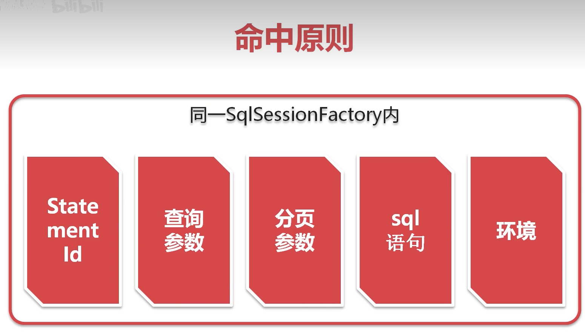

## 清除所有一级缓存   缓存周期

sqlsession.commit  rollbak   update  delete insert   create   clearcache   close   与表无关  


## 开启二级缓存

不同的sqlsession使用同一个缓存

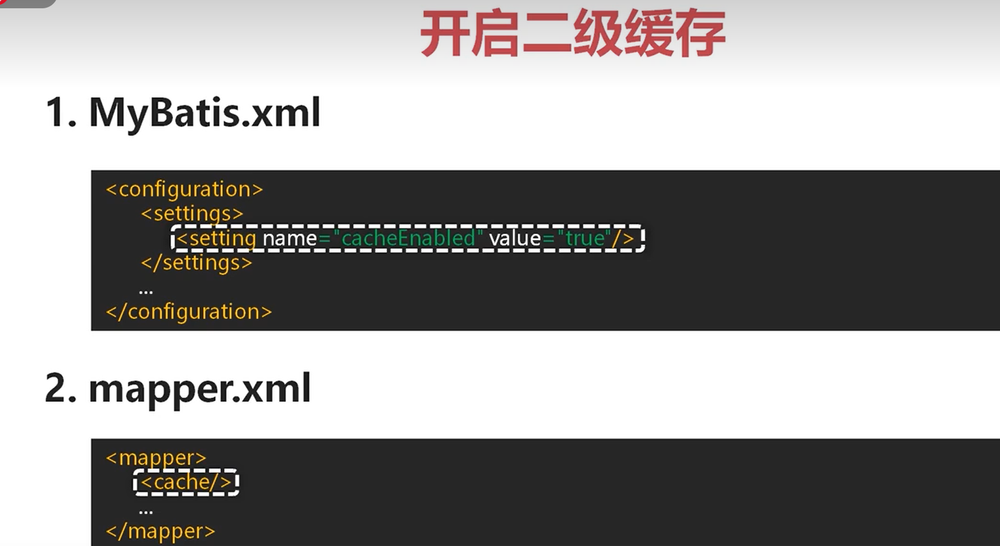

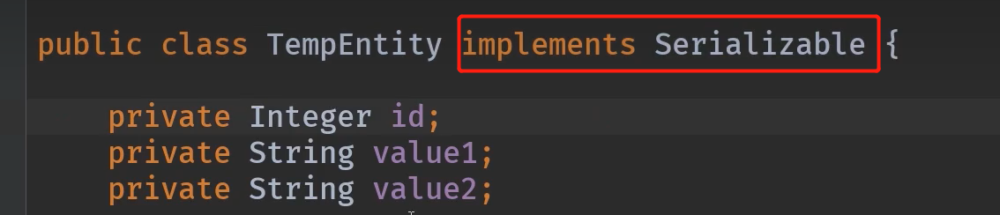

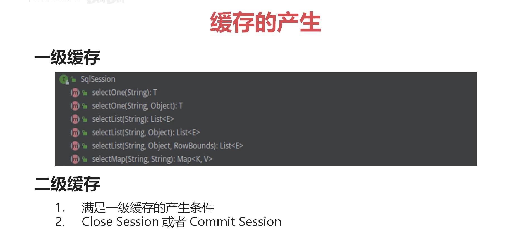

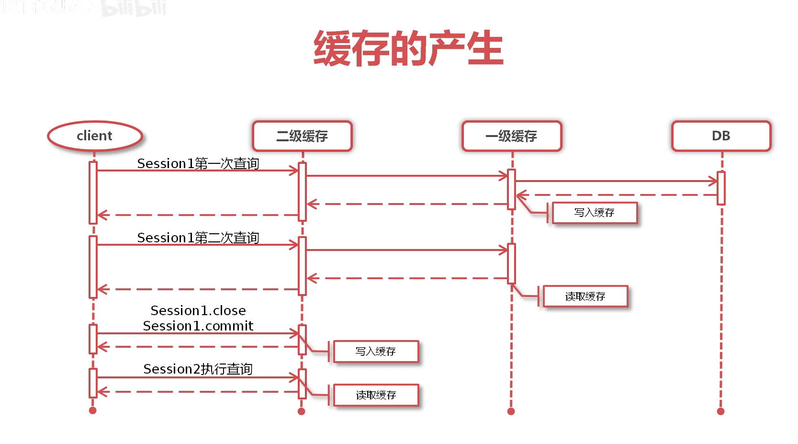

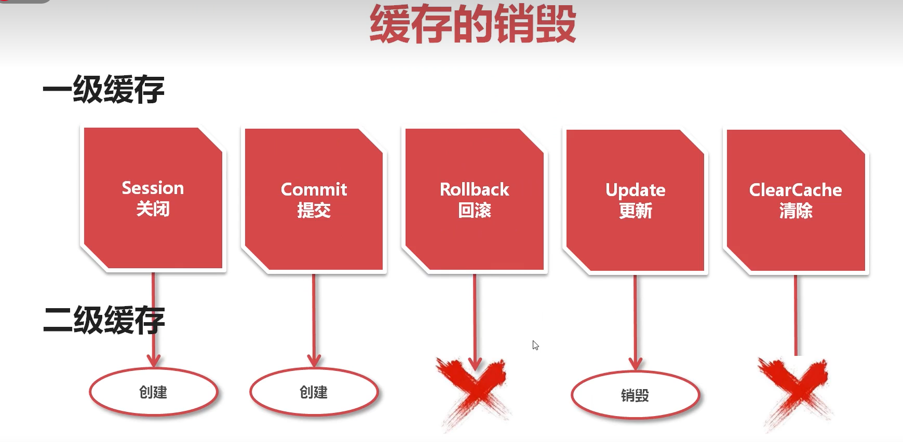

- update会销毁同一个namespace的缓存

## 缓存清除

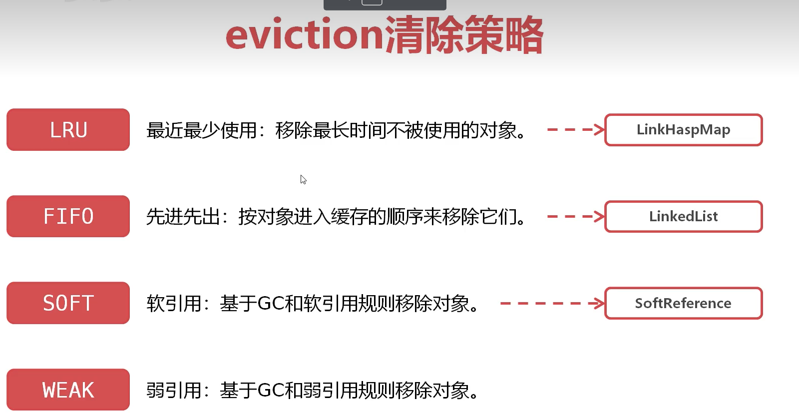

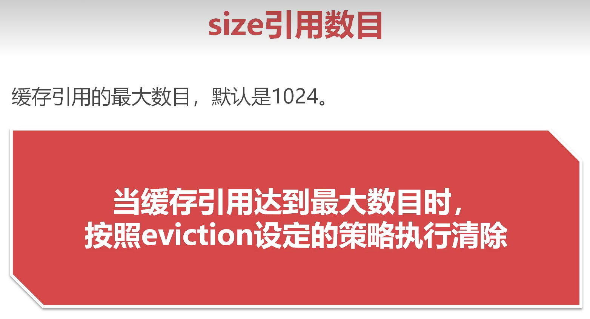

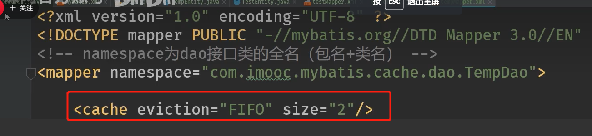

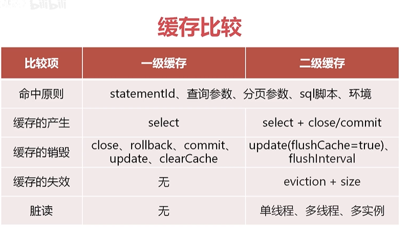

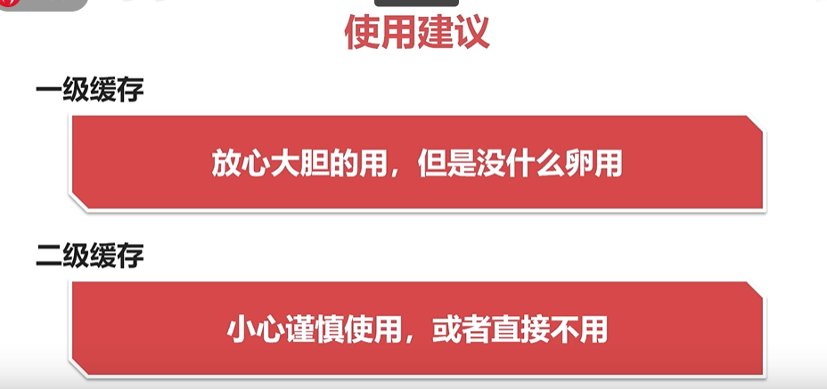

# kafka如何保证消息发送不丢失

1. 确保消息从peoducer能够到达broker端进行存储

   

producer本身有有个retrices重试参数，如果因为网络故障问题他会自动重试

2. broker能够将消息持久到磁盘，这个是操作系统格根据消息量和时间间隔异步去刷盘，并不是实时去刷盘无法保证可靠性，所以

   可以结合broker的leder和follow的机制，leader负责写follower负责同步leder的数据，结合acks=-1，表示leader中的partition到消息并同步给其他follow后才回复确认给peoducer；

3. consumer能够消费这个消息。只要前两者得到保证之后consumer不大可能会消费不到，即使消费不到也可以通过调整offset值来重新消费；


# kafka如何保证消息的顺序性

1. 自定义路由算法  将这些key路由同一个分区，kafka只能保证同一个分区消息顺序性，先进先出；
2. 如何是多线程异步去消费，则将消息放到阻塞队列中，保证消息的同步；

# kafka如何保证消息不重复消费

1. 幂等性原则，将消息做hash取值并保存到redis中，消费前判断该消息是否被消费过